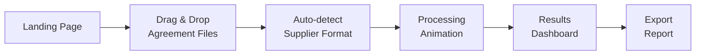

# Prisjämför — SaaS Product Redesign

Transform the current spreadsheet-style tool into a polished, customer-facing SaaS product. Customers drag & drop their discount agreement files and instantly get actionable pricing insights.

## Architecture Decisions

**Client-side only (for now)** — All processing happens in the browser. This gives us:
- 🔒 **Privacy selling point**: "Your prices never leave your computer"
- ⚡ **Zero backend costs** until we add auth/persistence later
- 📦 **Simple deployment**: static hosting (GitHub Pages, Netlify, etc.)

GNP files are hosted on the server and auto-loaded. Customers only upload their agreement files.

## User Flow



---

## Proposed Changes

### Page Structure — 3 Screens in One Page

The app is a **single-page flow** that transitions between three states:

#### Screen 1: Upload
- Clean landing with product messaging
- Drag & drop zone for agreement files (one per supplier)
- Auto-detect which supplier each file belongs to (Ahlsell = fixed-width, Rexel = semicolon-delimited)
- Visual indicators showing which suppliers are uploaded
- "Analysera" button activates when ≥2 suppliers are uploaded

#### Screen 2: Processing
- Smooth loading animation
- Step-by-step progress (Loading GNP... → Matching articles... → Calculating...)

#### Screen 3: Results Dashboard
Split into clear sections the user scrolls through:

| Section | Purpose |
|---|---|
| **Executive Summary** | Hero banner: total savings potential in kr, winning supplier, article count |
| **Savings Breakdown** | Per-supplier cards showing where each wins, with visual bars |
| **Group Analysis** | Interactive cards per rabattgrupp showing opportunity size, clickable to drill down |
| **Top Opportunities** | Ranked list of specific product groups where switching saves the most |
| **Negotiation Sheet** | "Take this to your next meeting" — groups to renegotiate per supplier, with target % |
| **Article Table** | Searchable, sortable, filterable table with virtual scrolling |
| **Export** | Download as Excel or branded PDF |

---

### Supplier-Agnostic Architecture

#### [NEW] [suppliers.js](file:///c:/GIT/Prisjämför/suppliers.js)

Registry pattern — each supplier is a config object:

```js
const SUPPLIERS = {
  ahlsell: {
    name: 'Ahlsell',
    color: '#E63946',
    gnpFile: 'ahlsell_gnp.txt',
    detectAgreement: (content) => { /* auto-detect logic */ },
    parseGNP: (content) => { /* returns Map<artNo, {list, grp, unit}> */ },
    parseAgreement: (content) => { /* returns Map<grp, discount%> */ },
  },
  rexel: {
    name: 'Rexel',
    color: '#457B9D',
    gnpFile: 'rexel_gnp.txt',
    detectAgreement: (content) => { /* auto-detect logic */ },
    parseGNP: (content) => { /* ... */ },
    parseAgreement: (content) => { /* ... */ },
  }
};
```

Adding a new supplier = adding one object. No other code changes needed.

#### [NEW] [engine.js](file:///c:/GIT/Prisjämför/engine.js)

Core comparison engine, supplier-agnostic:

```js
function compareSuppliers(supplierData) {
  // supplierData = { ahlsell: Map<artNo, netPrice>, rexel: Map<artNo, netPrice>, ... }
  // Returns: { matched[], perSupplier{}, groups{}, recommendations[] }
}
```

#### [NEW] [upload.js](file:///c:/GIT/Prisjämför/upload.js)

Drag & drop handling, file detection, progress UI.

#### [NEW] [dashboard.js](file:///c:/GIT/Prisjämför/dashboard.js)

All rendering logic for the results dashboard.

#### [NEW] [export.js](file:///c:/GIT/Prisjämför/export.js)

Excel export (using [SheetJS/xlsx](https://cdn.sheetjs.com/xlsx-0.20.0/package/dist/xlsx.full.min.js)) and PDF generation.

#### [MODIFY] [index.html](file:///c:/GIT/Prisjämför/index.html)

Complete rewrite — new page structure with the 3-screen flow.

#### [NEW] [style.css](file:///c:/GIT/Prisjämför/style.css)

Complete restyle — premium dark-mode-capable design with:
- CSS custom properties for theming
- Smooth transitions between screens
- Responsive grid layouts
- Animated progress indicators
- Glassmorphism cards

#### [DELETE] [app.js](file:///c:/GIT/Prisjämför/app.js)

Replaced by the modular files above.

---

### Feature Details

#### 1. Drag & Drop Upload
- Multi-file zone — drop one or more files at once
- Auto-detect supplier from file content (not filename)
- Show uploaded suppliers as colored chips with ✓
- Allow removing/replacing individual files
- Support both [.txt](file:///c:/GIT/Prisj%C3%A4mf%C3%B6r/rexel_gnp.txt) and [.csv](file:///c:/GIT/Prisj%C3%A4mf%C3%B6r/top100a.csv) formats

#### 2. Executive Summary
- Big hero number: "Du kan spara **47 320 kr**" (total savings if you always pick the cheapest)
- Winning supplier badge
- Matched vs excluded article counts
- One-sentence insight: "Rexel är billigare på 58% av artiklarna"

#### 3. Group Analysis
- Cards per rabattgrupp, color-coded by which supplier wins
- Each card shows: article count, avg diff%, total diff kr
- Click a card → filters the article table to that group
- Sort by: biggest savings, most articles, highest % diff

#### 4. Negotiation Recommendations
- Per supplier: "Grupper att förhandla om"
- Shows current discount% vs competitor's effective price
- Suggests target discount% to match competitor
- Sorted by impact (kr)

#### 5. Article Table
- Virtual scrolling (render only visible rows) — handles 100k+ articles without lag
- Search by E-nummer
- Sort by any column
- Filter by group, supplier winner, diff range
- Sticky header

#### 6. Export
- **Excel**: Full article list + summary sheet + group analysis sheet
- **PDF**: Branded summary report suitable for meetings

---

## User Review Required

> [!IMPORTANT]
> **File structure change**: This replaces the single [app.js](file:///c:/GIT/Prisj%C3%A4mf%C3%B6r/app.js) with 5 modular files (`suppliers.js`, `engine.js`, `upload.js`, `dashboard.js`, `export.js`). The existing parsing logic is preserved but reorganized.

> [!NOTE]
> **Virtual scrolling for the article table** is important — the current approach of rendering 500 DOM rows will not scale when customers see 50k+ results. I'll implement a lightweight virtual scroller (no library needed).

---

## Verification Plan

### Manual Verification
1. Drag & drop the existing Ahlsell and Rexel agreement files → verify auto-detection works
2. Confirm all dashboard numbers match the current tool's output
3. Test with large files — confirm no browser lag
4. Test responsive layout on mobile viewport
5. Test Excel export — open in Excel, verify all data
6. Click through group analysis cards → verify article table filters correctly
